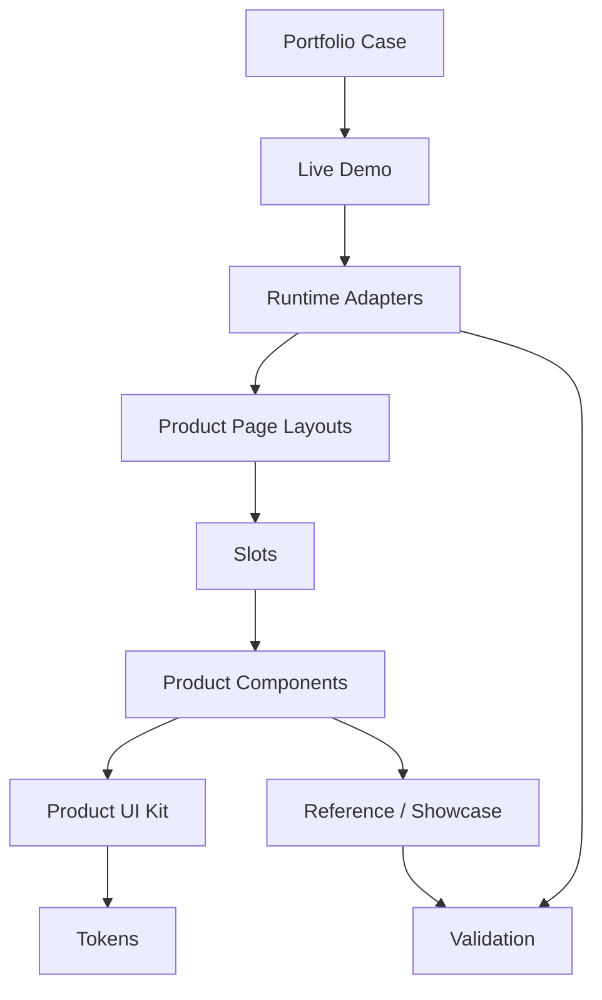

# CoastKey Interface System

CoastKey Interface System is a curated public source snapshot and technical
showcase for the CoastKey portfolio case.

It explains how a product interface system can be split into a Product UI Kit,
Product Components, Component Blocks, Product Page Layouts, runtime adapters,
reference surfaces, and validation gates.

## What This Repository Is

- A public technical showcase for a portfolio case.
- A curated architecture package, not a copied working repository.
- A set of selected documents, diagrams, and simplified examples.
- A review surface for interface-system thinking, runtime data boundaries, and
  component contract patterns.

## What This Repository Is Not

- Not a production codebase.
- Not a commercial SaaS product.
- Not a full open-source release.
- Not a mirror of the private working monorepo.
- Not the full Live Demo source.
- Not the internal AI or AgentOS workflow.

The examples are selected source excerpts and simplified public-safe examples.
They are meant to explain the architecture, not to run the full product.

## What To Inspect First

1. [Interface System Architecture](docs/02-interface-system-architecture.md)
2. [Runtime Data Flow](docs/03-runtime-data-flow.md)
3. [Layout Contracts and Slots](docs/04-layout-contracts-and-slots.md)
4. [Component Contracts](docs/05-component-contracts.md)
5. [Reference Surfaces and Validation](docs/06-reference-surfaces-and-validation.md)
6. [AI-assisted Workflow Example](docs/08-ai-assisted-workflow-example.md)

## Related Surfaces

- Portfolio case RU: will be added after publication.
- Portfolio case EN: will be added after publication.
- Live Demo: will be added after final domain setup.
- Component Showcase: will be added after publication.

## Architecture In One Minute

## Public / Private Boundary

This repository includes public-safe architecture descriptions, selected
examples, diagrams, and review checklists.

It excludes private working docs, source data, generated runtime JSON, prompts,
skills, routers, backlog state, deployment details, private media assets,
private Figma links, and internal workflow history.

See [Public / Private Boundary](docs/09-public-private-boundary.md) and
[Public Safety Audit](PUBLIC-SAFETY-AUDIT.md) before publishing.
