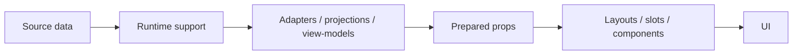

# 03 - Runtime Data Flow

CoastKey separates source-backed runtime behavior from reusable product UI.
Product components do not import source data. They receive prepared props from
runtime adapters.

## Flow



## Ownership

Runtime support owns source-backed helpers, taxonomy, media maps, session
helpers, and view-model inputs.

Adapters own:

- route and query state;
- permissions and gating;
- callbacks;
- session/demo state;
- taxonomy and filtering;
- media resolution;
- favorites and booking state;
- mapping source-backed records into display-ready props.

Components own:

- visual anatomy;
- token-backed styling;
- variants and states;
- slots;
- accessibility and interaction affordances;
- rendering from prepared props.

## Boundary Rule

Product components should not import raw source data, generated runtime JSON,
URL state, session state, taxonomy files, map state, or booking state directly.

Allowed:

```text
runtime support -> adapter -> prepared props -> product component
```

Avoid:

```text
product component -> source data or generated runtime JSON
```

## Demo Scope

Auth, account, booking, favorites, moderation, and unavailable-module states
are represented as demo/session/source-backed UI flows unless a separate
backend scope is opened. This repository does not claim production backend
readiness.
