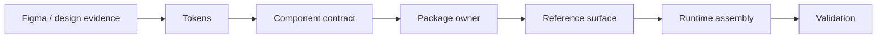

# 07 - Figma To Runtime

Figma is design evidence and product-system planning input. It is not runtime
source truth.

## Public-Safe Pipeline

## Transfer Rule

Design transfer output is treated as a workbench. It must be normalized into
owner layers before final handoff:

- neutral shared mechanics;
- Product UI Kit;
- Product Components;
- Product Component Blocks;
- Product Page Layouts;
- runtime adapters and view-models;
- reference/showcase surfaces;
- public facades and private internals.

## What Is Not Included

This repository does not include private Figma links, node IDs, plugin prompts,
raw transfer prompts, or internal transfer matrices.

## Token Alignment

The public idea is simple: design variables and runtime theme should converge
on the same token source. If a semantic token is missing, it should be added as
a source-token decision rather than patched locally in a page.
