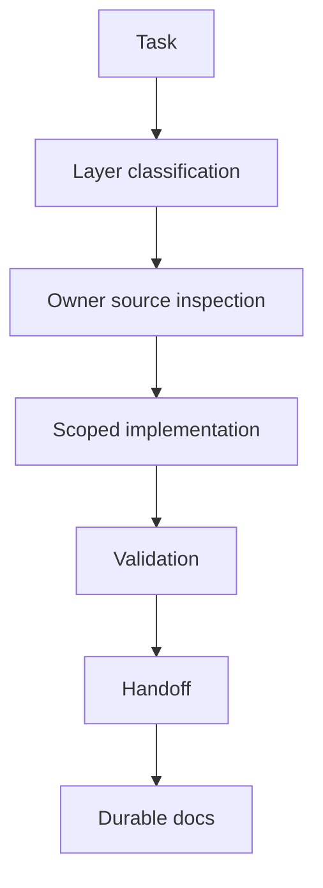

# 08 - AI-Assisted Workflow Example

This document describes a public-safe process pattern. It does not expose
private prompts, skills, routers, task queues, session history, local tool
setup, or internal orchestration.

## Workflow

## Public-Safe Process

1. Define the product or design intent.
2. Classify the affected layer.
3. Inspect owner docs and owner source.
4. Identify public/private boundaries.
5. Implement or document the smallest safe slice.
6. Run validation selected by the changed layer.
7. Hand off with changed files, affected consumers, checks, and open review
   items.
8. Promote durable decisions into the correct owner docs.

## Human / AI Collaboration

The human owns product direction, visual judgment, acceptance, and final QA.
AI assistance can help inspect source, map owner layers, draft scoped changes,
summarize validation, and prepare handoff notes.

The work remains source-backed and human-directed.
